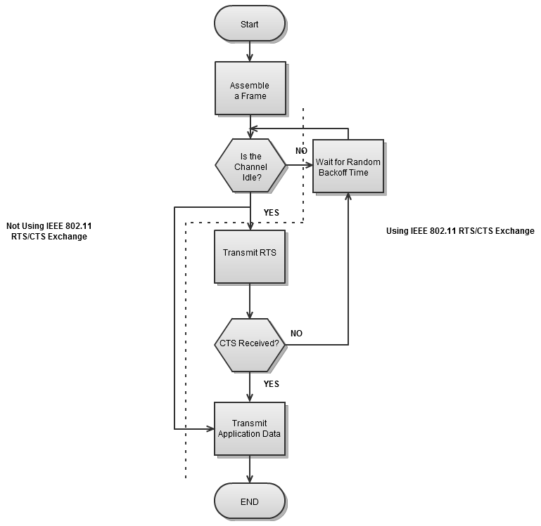

# fsl_80211_csma_ca
FSL implementation of the 802.11 CSMA/CA state path

## Render


## Impl
```fsl
machine_name      : "CSMA/CA from 802.11";
machine_author    : "John Haugeland <stonecypher@gmail.com>";
machine_license   : MIT;
machine_language  : en;
machine_reference : https://upload.wikimedia.org/wikipedia/commons/1/1d/Csma_ca.svg;
machine_comment   : "The way the font's scan comes out in that svg, though";
machine_version   : 1.0.0;
fsl_version       : 1.0.0;

start_states     : [Start];
start_states     : [End];


Start => "Assemble a Frame" => "Channel idle?";

"Channel idle?" 'No' => "Choose a random\nback-off time" -> Wait -> "Channel idle?";
"Channel idle?" 'Yes' => "Using 802.11\nCTS/RTS exchange?";

"Using 802.11\nCTS/RTS exchange?" 'No'  -> "Transmit app data" => End;
"Using 802.11\nCTS/RTS exchange?" 'Yes' => "Transmit RTS" => "CTS received?";

"CTS received?" 'No'  -> "Choose a random\nback-off time";
"CTS received?" 'Yes' => "Transmit app data";
```

## Reference
From [this Wikipedia page](https://commons.wikimedia.org/wiki/File:Csmaca_algorithm.png):

